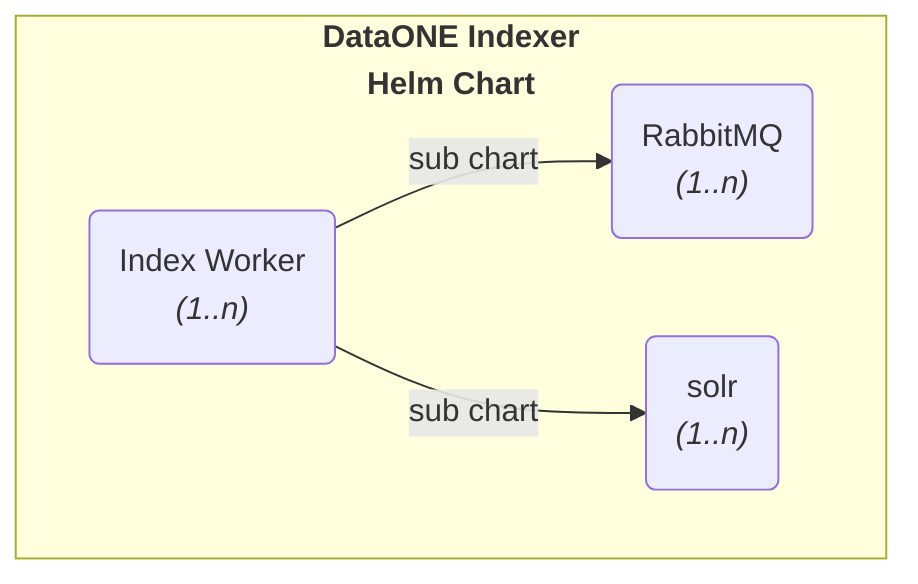

# DataONE Indexer

Also see [RELEASE-NOTES.md](./RELEASE-NOTES.md)

The DataONE Indexer is a system that processes index tasks created by other components. The DataONE
Indexer comprises three main subsystems, each defined by its own helm subsystem chart:

- **index-worker**: a subsystem implementing a Worker class to process index jobs in parallel
- **rabbitmq**: a deployment of the RabbitMQ queue management system
- **solr**: a deployment of the SOLR full-text search system



Clients are expected to register index task messages to be processed in the RabbitMQ queue. Upon
startup, the RabbitMQ workers register themselves as handlers of the index task messages. As
messages enter the queue, RabbitMQ dispatches these to registered workers in parallel, and workers
in turn process each associated object and insert a new index entry into SOLR.

See [LICENSE.md](./LICENSE.md) for the details of distributing this software.

## Building Docker image

The image can be built with either `docker` or `nerdctl` depending on which container environment
you have installed. For example, using Rancher Desktop configured to use `nerdctl`:

```shell
mvn clean package -DskipTests
nerdctl build -t dataone-index-worker:2.4.0 -f docker/Dockerfile --build-arg TAG=2.4.0 .
```

If you are building locally for Kubernetes on rancher-desktop, you'll need to set the namespace
to `k8s.io` using a build command such as:

```shell
mvn clean package -DskipTests
nerdctl build -t dataone-index-worker:2.4.0 -f docker/Dockerfile --build-arg TAG=2.4.0 \
         --namespace k8s.io  .
```

## Publish the image to GHCR

For the built image to be deployable in a remote kubernetes cluster, it must first be published to
an image registry that is visible to Kubernetes. For example, we can make the published image
available via the GitHub Container Registry (ghcr.io) so that it can be pulled by
Kubernetes. For this to work, the image must be tagged with the ghcr.io URL, so it can be published.
Then the image can be pushed to the registry after logging in with a suitable GitHub PAT.

Note that, for the image to be associated with a particular GitHub repository, a metadata LABEL can
be added to the image that associates it when it is built; see this entry in the Dockerfile:

```dockerfile
LABEL org.opencontainers.image.source="https://github.com/dataoneorg/dataone-indexer"
```

Commands for pushing the built image (example assuming tag is `2.4.0`):

```shell
GITHUB_PAT="your-own-secret-GitHub-Personal-Access-Token-goes-here"
TAG=2.4.0

nerdctl tag dataone-index-worker:$TAG ghcr.io/dataoneorg/dataone-index-worker:$TAG
echo $GITHUB_PAT | nerdctl login ghcr.io -u DataONEorg --password-stdin
nerdctl push ghcr.io/dataoneorg/dataone-index-worker:$TAG
```

Once the image has been pushed, it may be private and will need to be made public and assigned to
the `dataone-indexer` repository if the LABEL wasn't set as described above.

## Publishing the Helm Chart

The helm chart may also be published to a helm repository for use by others as a top-level
application deployment or as a dependency sub-chart. For example, we can publish the chart
via the GitHub Container Registry (ghcr.io). For this to work, the chart must contain an annotation
to associate it with the correct repository; see this entry in [`Chart.yaml`](./helm/Chart.yaml):

```yaml
# OCI Annotations - see https://github.com/helm/helm/pull/11204
sources:
  - https://github.com/dataoneorg/dataone-indexer
```

The chart must then be packaged:

```shell
helm package ./helm
```

...which creates a zipped tar file named `dataone-indexer-{version}.tgz`, where `{version}` reflects
the chart `version` in [`Chart.yaml`](./helm/Chart.yaml). The chart can then be published to the
correct ghcr.io URL, after logging in with a suitable GitHub PAT:

(example assumes the chart version is 0.5.0)
```shell
GITHUB_PAT="your-own-secret-GitHub-Personal-Access-Token-goes-here"
TAG=2.4.0
helm push  dataone-indexer-0.5.0.tgz  oci://ghcr.io/dataoneorg/charts
```
NOTE the use of **charts** in the oci url, to distinguish helm charts from docker images.

## Deploying the application via Helm

Helm provides a simple mechanism to install all application dependencies and configure the
application in a single command. To deploy using helm to a release named `d1index` and also in a
namespace named `d1index`, and then view the deployed pods and services, use a sequence like:

```shell
kubectl create namespace d1index

# to use the local files
helm install -n d1index d1index ./helm

# or to pull the packaged chart with a specific release version (e.g. 1.2.0)...
helm install -n d1index d1index oci://ghcr.io/dataoneorg/charts/dataone-indexer --version 1.2.0

kubectl -n d1index get all
```

and to uninstall the helm release, use:

```shell
helm -n d1index uninstall d1index
```

Note that this helm chart also installs rabbitmq and solr, which can be partially configured
through the values.yaml file in the parent chart through exported child properties.

> [!IMPORTANT]
> Make sure the RabbitMQ queue is empty, before upgrading or installing a new chart version for the
> first time, because each new chart version will create a new PV/PVC where the queue is stored.
> This can be overridden by setting .Values.rabbitmq.nameOverride to the same name as the previous
> version, but this is NOT recommended, since the RabbitMQ installation then becomes an upgrade
> instead of a fresh install, and may require some manual intervention.

### Authentication Notes

#### RabbitMQ

The rabbitmq service runs under the username and password that are set via values.yaml

```yaml
rabbitmq:
  auth:
    username: rmq
    existingPasswordSecret: ""      ## (must contain key: `rabbitmq-password`)
```

...where `existingPasswordSecret` is the name of a Kubernetes secret that contains the password,
identified by a key named `rabbitmq-password`.

> **NOTE:** it appears that this information is cached
on a PersistentVolumeClaim that is created automatically by rabbitmq. If the credentials are changed
in `values.yaml` and/or the secret, therefore, authentication will fail because they will conflict
with the cached values in the PVC. If you are just testing, the problem can be resolved by deleting
the PVC. In production, the PVC would also be used for maintaining durable queues, and so it may not
be reasonable to delete the PVC. You can get the name and identifiers of the PVCs with
`kubectl -n d1index get pvc`.

#### Solr

The helm installation does not currently configure Solr with authentication enabled, since the
service is not exposed outside the Kubernetes cluster. Mentions of logins in the following sections
can therefore be ignored. However, this should be changed to use authentication if connecting to a
solr instance outside the cluster.

## Checking if SOLR is configured

Logging in using the SOLR_AUTHENTICATION_OPTS and SOLR_AUTH_TYPE env variables (if applicable)
allows the `solr` command to be executed to check the server status:

```shell
$ export SOLR_AUTH_TYPE=basic
$ export SOLR_AUTHENTICATION_OPTS="-Dbasicauth=${SOLR_ADMIN_USERNAME}:${SOLR_ADMIN_PASSWORD}"
$ solr status -z ${SOLR_ZK_HOSTS} -c ${SOLR_COLLECTION}

Found 1 Solr nodes:

Solr process 8 running on port 8983
{
  "solr_home":"/opt/bitnami/solr/server/solr",
  "version":"9.0.0 a4eb7aa123dc53f8dac74d80b66a490f2d6b4a26 - janhoy - 2022-05-05 01:00:08",
  "startTime":"2022-10-11T07:08:50.155Z",
  "uptime":"0 days, 0 hours, 21 minutes, 52 seconds",
  "memory":"70.9 MB (%13.8) of 512 MB",
  "cloud":{
    "ZooKeeper":"d1index-zookeeper:2181/solr",
    "liveNodes":"3",
    "collections":"1"}}
```

# SOLR Dashboard

Once the SOLR server is up and running, connect to the SOLR Dashboard by creating a kube proxy, and
then browse to the local address:

```shell
k8 port-forward -n d1index service/d1index-solr 8983:8983 & echo "Solr URL: 127.0.0.1:8983/solr/"
```

You'll need to log in with the helm-configured SOLR admin user and password, if applicable.

Once the proxy is set up, you can also run API calls from the [ConfigSet API](https://solr.apache.org/guide/6_6/configsets-api.html) and
[Collections API](https://solr.apache.org/guide/6_6/collections-api.html).

```shell
curl -u ${SOLR_ADMIN_USERNAME}:${SOLR_ADMIN_PASSWORD} http://localhost:8983/solr/admin/configs?action=CREATE\&name=dataone-index --header "Content-Type:text/xml" -X POST -d @dataone-index.zip
{
  "responseHeader":{
    "status":0,
    "QTime":5974}}
curl -u ${SOLR_ADMIN_USERNAME}:${SOLR_ADMIN_PASSWORD} http://localhost:8983/solr/admin/configs?action=list
curl -u ${SOLR_ADMIN_USERNAME}:${SOLR_ADMIN_PASSWORD} http://localhost:8983/solr/admin/collections?action=list
```

### Admin tools for rabbitmq

Once rabbitmq is configured, the web console can be accessed by port-forwarding.

```shell
k8 -n jones port-forward pod/d1index-rabbitmq-0 15672:15672 &
```

then login to the Rabbitmq web console: http://localhost:15672

You can also download a copy of `rabbitmqadmin` from http://localhost:15672/cli/rabbitmqadmin,
and the `rabbitmqadmin` command can be used to interact with the server. First, you need to set up a
config file for `rabbitmqadmin` that provides some default values:

```shell
$ cat rmq.conf
[default]
hostname = d1index-rabbitmq-headless
port = 15672
username = rmq
password = your-client-pw-here
declare_vhost = / # Used as default for declare / delete only
vhost = /         # Used as default for declare / delete / list
```

- List exchanges and queues
    - `rabbitmqadmin -c rmq.conf -N default -U rmq -p $RMQPW list exchanges --vhost=/`
    - `rabbitmqadmin -c rmq.conf -N default -U rmq -p $RMQPW list queues --vhost=/`
- Declare exchanges, queues, and bindings
    - `rabbitmqadmin -c rmq.conf -N default declare exchange name=testexchange type=direct -U rmq -p $RMQPW --vhost=/`
    - `rabbitmqadmin -c rmq.conf -N default declare queue name=testqueue type=direct -U rmq -p $RMQPW --vhost=/`
    - `rabbitmqadmin -c rmq.conf -N default -U rmq -p $RMQPW declare binding source=testexchange destination=testqueue routing_key=testqueue --vhost=/`
- Publish a bunch of messages to a queue
```
for n in $(seq 1 30); do echo $n; rabbitmqadmin -c rmq.conf -N default -U rmq -p $RMQPW publish exchange=testexchange routing_key=testqueue payload="Message: ${n}" --vhost=/; done
```

## Switching the Storage System
The Dataone Indexer can be configured to use different storage systems by setting the environment
variable `DATAONE_INDEXER_OBJECT_MANAGER_CLASS_NAME`.
By default, this variable is not set, and the indexer uses
`org.dataone.cn.indexer.object.hashstore.HashStoreObjManager`, which enables support for Hashstore.
To use the legacy storage system instead, set the variable to
`org.dataone.cn.indexer.object.legacystore.LegacyStoreObjManager`.
In the helm chart, this can be achieved by defining `DATAONE_INDEXER_OBJECT_MANAGER_CLASS_NAME` in `idxworker.extraEnvVars`:

```yaml
idxworker:
  extraEnvVars:
    - name: DATAONE_INDEXER_OBJECT_MANAGER_CLASS_NAME
      value: "org.dataone.cn.indexer.object.legacystore.LegacyStoreObjManager"
```

### Additional Configuration for the Legacy Storage System
If you choose the legacy object manager, additional properties may be required:
1. Base URL Configuration
    - Set the base URL using the property `dataone.mn.baseURL` in a property file, or use the environment
      variable `DATAONE_INDEXER_NODE_BASE_URL`.
    - The environment variable overrides the property file.
    - Example value: `https://dev.nceas.ucsb.edu/knb/d1/mn`
2. Authentication Token Configuration

   To access and index private datasets on a Metacat instance, the dataone-indexer needs an
   authentication token, which may be obtained from DataONE administrators (see the [Metacat Helm
   README](https://github.com/NCEAS/metacat/blob/develop/helm/README.md#setting-up-a-token-and-optional-ca-certificate-for-indexer-access)).
   - The indexer expects to find a Kubernetes Secret named: `<release-name>-indexer-token`, which contains the auth token associated with the key `DataONEauthToken`; e.g:

     ```shell
     kubectl create secret generic <release-name>-indexer-token \
                 --from-file=DataONEauthToken=my-token.jwt
     ```

     The secret name must be `<release-name>-indexer-token`, to work with the indexer chart. The indexer can operate without this Secret, but will only be able to index public-readable datasets.
    - For non-k8s deployments, set the access token using the environment variable `DATAONE_INDEXER_AUTH_TOKEN`, or
      Specify a token file path via the property `dataone.nodeToken.file` in a property file.
    - The environment variable takes precedence.

3. Scientific Metadata Root Directory
    - Use `DATAONE_INDEXER_METACAT_DOCUMENT_ROOT_DIR` (env var) or `index.document.root.directory` (property).
    - Again, the environment variable overrides the property file.
4. Data Object Root Directory
    - Use `DATAONE_INDEXER_METACAT_DATA_ROOT_DIR` (env var) or `index.data.root.directory` (property).
    - The environment variable takes precedence.

## History

This is a refactored version of the original DataONE [d1_cn_index_processor](https://github.com/DataONEorg/d1_cn_index_processor) that runs
completely independently of other DataONE Coordinating Node services. It is intended to be deployed
in a Kubernetes cluster environment, but is written such that it can also be deployed in other
environments as needed.
